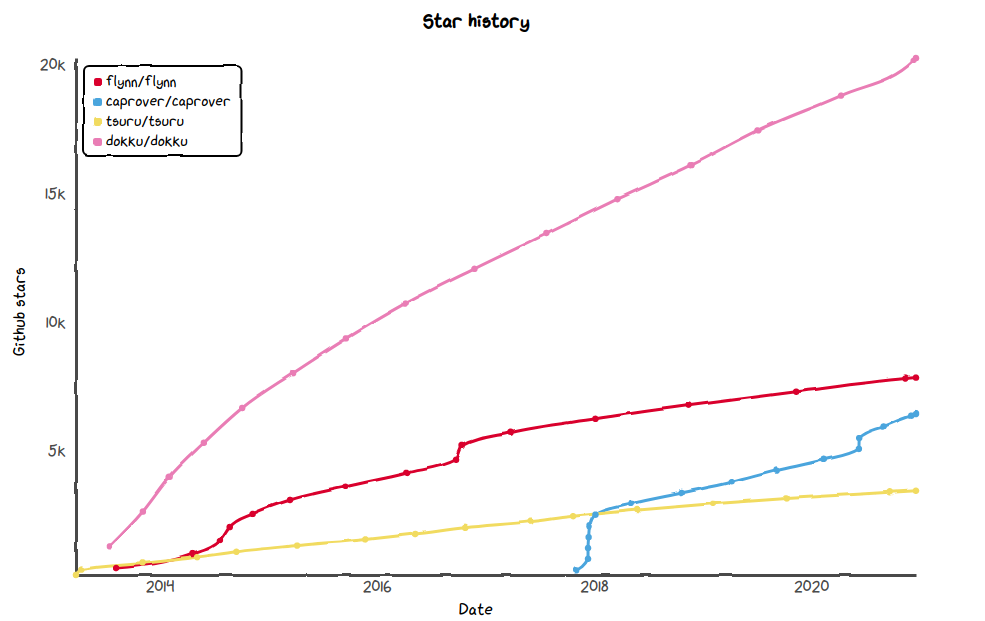

# Open Source PaaS List

Update 2020: I think Kubernetes is the future. Kubernetes is no PaaS. But sooner or later there will be open source PaaS solutions on top of Kubernetes.

Update 2021: I decided to stick to Linux VPS (virtual private server) with systemd and some Python script to deploy my web applications. No PaaS, no Kubernetes, no Ansible, no Terraform, no AWS, no Heroku.

Platform as a Service simplifies and streamlines deployment.

Yes, I can use ssh+vi to manage servers. I did this since 1998, but ssh+vi is not 
a professional way to manager servers.

Yes, I know how to use configuration management (SaltStack or Ansible) to manage servers. But this misses
the streamlining effect, which you get from a PaaS solution.

PaaS are usualy using some kind of containers to execute the applications.

# Goal

Run several unrelated applications on one VPS (virtual private server).

## Required Features

* As a software developer I want to deploy a several Django based app on one VPS.
* I don't want to run a big infrastructure, I just have one VPS. Kubernetes based solutions don't make sense for me at the moment.
* I want http. Letsencryptit support is needed.
* Documentation. The PaaS should be documented. I don't want to be the first who tries to get a Django based solution running on it.

## Dokku

Dokku copies Heroku. I guess this is very great if you want to switch from Heroku to a self-hosted solution. But this
is not my use case.

It is mostly written in Shell. I don't trust Shellscripts, but the author is maintaining it with love since several years. Looks stable.

Dokku has three ways to operate: herokuish buildscripts, Dockerfiles, Docker-Images.

First I thought "herokuish buildscripts" are great, but maybe this mixes two things which don't belong together: Creating a container and running a container.

Multi-Host: No

With Dokku you can "link" an App to a database. This automatically creates a matching DATABASE_URL. 
See [Linking backing services to applications](http://dokku.viewdocs.io/dokku/deployment/application-deployment/#linking-backing-services-to-applications)
That's cool.

## Flynn

This was cool some years ago. Now there are 430 open issues, and the development has stalled.

## CapRover

[CapRover](https://github.com/caprover/caprover)

Has a web-GUI.

Written in Typescript.

Nice docs.

Nice feature [Rollback to previous Docker Image](https://caprover.com/docs/deployment-methods.html#one-click-rollback)

The docs advertise DigitalOcean, but CapRover runs on Hetzner or any other VPS.

Multi-Host: Yes (Docker Swarm)

## Tsuru

[Tsuru](https://tsuru.io/)

Written in go. Uses Docker-Swarm.

Multi-Host: Yes

# kel
[kelproject](https://github.com/kelproject) development has stalled.

# N Linux User + Systemd

* nginx as https endpoint and reverse proxy
* Per system one Linux user and an http server started via systemd. See [gunicorn systemd config](https://docs.gunicorn.org/en/stable/deploy.html#systemd)
* https per wildcard domain: [Certbot wildcard Domain](https://certbot.eff.org/lets-encrypt/ubuntufocal-nginx)

I would call it "hand-made PaaS". Depending on the way you do it, it is ssh+vi or configuration management.

# Webmin, Virtualmin ...

AFAIK they support docker, too.

# Too big

At least at the moment I think solutions based on Kubernetes are too big for me. I have only one VPS, I don't want a run a cloud.

* Rancher (SusE)
* OpenShift (RedHat)
* Cloud Foundry

# Star-History

Source: [star-history](https://star-history.t9t.io/#caprover/caprover&flynn/flynn&tsuru/tsuru&dokku/dokku)

# Related

https://www.linux-magazin.de/ausgaben/2018/09/bitparade-7/

# WOL

[Thomas Working-out-Loud](//github.com/guettli/wol)

